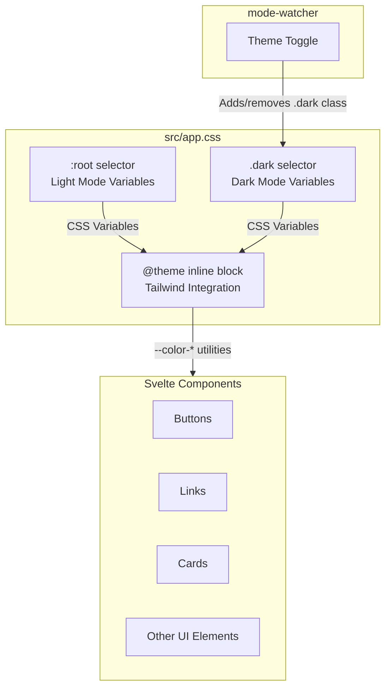

# Design Document: SotaTek Color Palette

## Overview

This design document outlines the technical approach for implementing the SotaTek color palette in the Mermaid Live Editor application. The implementation will update the existing CSS custom properties in `src/app.css` to reflect the SotaTek brand colors while maintaining full backward compatibility with the existing theming system.

The SotaTek palette centers on a "Technology & Trust" theme with professional blue tones:

- Primary: #0052CC (SotaTek Blue)
- Primary Dark: #003399
- Primary Light: #007BFF
- Gradient: #00358E → #0066FF (Dark Mode background)
- Info Accent: #00B4DB
- Success Accent: #28A745

The implementation leverages the existing Tailwind CSS v4 configuration with CSS custom properties, ensuring seamless integration without requiring component-level changes.

## Architecture



The architecture maintains the existing three-layer approach:

1. **Base Variables** (`:root`): Define light mode colors as CSS custom properties
2. **Dark Mode Overrides** (`.dark`): Override variables for dark mode
3. **Tailwind Integration** (`@theme inline`): Map CSS variables to Tailwind color utilities

## Components and Interfaces

### CSS Custom Properties Interface

The following CSS custom properties will be updated to implement the SotaTek palette:

#### Light Mode (`:root`)

| Variable               | Current Value         | New Value           | Purpose                      |
| ---------------------- | --------------------- | ------------------- | ---------------------------- |
| `--background`         | `hsl(0 0% 100%)`      | `hsl(0 0% 100%)`    | Surface background (#FFFFFF) |
| `--foreground`         | `hsl(222.2 84% 4.9%)` | `hsl(0 0% 10%)`     | Dark text (#1A1A1A)          |
| `--primary`            | `hsl(240 10% 91%)`    | `hsl(214 100% 40%)` | Primary blue (#0052CC)       |
| `--primary-foreground` | `hsl(255 20% 15%)`    | `hsl(0 0% 100%)`    | White text on primary        |
| `--accent`             | `hsl(340 100% 44%)`   | `hsl(191 100% 43%)` | Info accent (#00B4DB)        |

#### Dark Mode (`.dark`)

| Variable             | Current Value          | New Value           | Purpose                  |
| -------------------- | ---------------------- | ------------------- | ------------------------ |
| `--background`       | `hsl(222.2 84% 4.9%)`  | Gradient CSS        | Gradient background      |
| `--foreground`       | `hsl(210 40% 98%)`     | `hsl(0 0% 100%)`    | White text (#FFFFFF)     |
| `--primary`          | `hsl(210 40% 30%)`     | `hsl(214 100% 30%)` | Primary dark (#003399)   |
| `--muted-foreground` | `hsl(215 20.2% 65.1%)` | `hsl(0 0% 88%)`     | Secondary text (#E0E0E0) |

#### New Variables

| Variable           | Value               | Purpose                  |
| ------------------ | ------------------- | ------------------------ |
| `--primary-light`  | `hsl(211 100% 50%)` | Hover state (#007BFF)    |
| `--gradient-start` | `hsl(214 100% 28%)` | Gradient start (#00358E) |
| `--gradient-end`   | `hsl(214 100% 50%)` | Gradient end (#0066FF)   |
| `--success`        | `hsl(134 61% 41%)`  | Success accent (#28A745) |
| `--info`           | `hsl(191 100% 43%)` | Info accent (#00B4DB)    |

### Gradient Background Implementation

For dark mode, the main application container will use a CSS gradient:

```css
.dark body {
  background: linear-gradient(135deg, var(--gradient-start), var(--gradient-end));
}
```

This will be implemented by updating the `--background` variable in dark mode to use a solid fallback color, while applying the gradient directly to the body element.

### Tailwind Integration

The `@theme inline` block will be extended to include new color mappings:

```css
@theme inline {
  /* Existing mappings preserved */
  --color-primary-light: var(--primary-light);
  --color-success: var(--success);
  --color-info: var(--info);
  --color-gradient-start: var(--gradient-start);
  --color-gradient-end: var(--gradient-end);
}
```

## Data Models

### Color Value Specifications

The SotaTek palette colors with their HSL equivalents:

| Color Name     | Hex     | HSL                 |
| -------------- | ------- | ------------------- |
| Primary        | #0052CC | hsl(214, 100%, 40%) |
| Primary Dark   | #003399 | hsl(214, 100%, 30%) |
| Primary Light  | #007BFF | hsl(211, 100%, 50%) |
| Gradient Start | #00358E | hsl(214, 100%, 28%) |
| Gradient End   | #0066FF | hsl(214, 100%, 50%) |
| Surface White  | #FFFFFF | hsl(0, 0%, 100%)    |
| Dark Text      | #1A1A1A | hsl(0, 0%, 10%)     |
| Light Text     | #FFFFFF | hsl(0, 0%, 100%)    |
| Secondary Text | #E0E0E0 | hsl(0, 0%, 88%)     |
| Info Accent    | #00B4DB | hsl(191, 100%, 43%) |
| Success Accent | #28A745 | hsl(134, 61%, 41%)  |

### Contrast Ratio Compliance

WCAG 2.1 AA requires minimum contrast ratios:

- Normal text: 4.5:1
- Large text: 3:1

| Combination        | Contrast Ratio | Compliance |
| ------------------ | -------------- | ---------- |
| #1A1A1A on #FFFFFF | 16.1:1         | ✓ AAA      |
| #FFFFFF on #0052CC | 5.9:1          | ✓ AA       |
| #FFFFFF on #003399 | 9.4:1          | ✓ AAA      |
| #FFFFFF on #00358E | 10.8:1         | ✓ AAA      |
| #E0E0E0 on #00358E | 8.5:1          | ✓ AAA      |

## Correctness Properties

_A property is a characteristic or behavior that should hold true across all valid executions of a system—essentially, a formal statement about what the system should do. Properties serve as the bridge between human-readable specifications and machine-verifiable correctness guarantees._

### Property Reflection

After analyzing the acceptance criteria, I identified the following testable properties and consolidated redundant ones:

**Identified Properties:**

- 2.4: Contrast ratio compliance (property)
- 5.1: All palette colors defined as CSS variables (property)
- 6.3: Semantic color mappings preserved (property)
- 6.4: Theme variables resolve to palette colors (property)
- 7.1: Existing CSS property names preserved (property)

**Consolidation:**

- Properties 5.1, 6.3, and 7.1 can be combined into a single property about CSS variable preservation and completeness
- Properties 6.4 is subsumed by verifying the actual CSS values match the palette

**Final Properties:**

### Property 1: CSS Variable Completeness and Preservation

_For any_ CSS custom property name that existed before the palette update, that property name SHALL still exist after the update, AND _for any_ SotaTek palette color, there SHALL exist a corresponding CSS custom property with the correct value.

**Validates: Requirements 5.1, 6.3, 7.1**

### Property 2: Contrast Ratio Compliance

_For any_ foreground/background color pair used for text content in the theme system, the contrast ratio SHALL be at least 4.5:1 as required by WCAG 2.1 AA.

**Validates: Requirements 2.4**

### Property 3: Theme Mode Color Resolution

_For any_ theme color variable, WHEN the theme mode changes between light and dark, the variable SHALL resolve to the mode-appropriate SotaTek palette color.

**Validates: Requirements 3.4, 3.5, 6.4**

### Property 4: Tailwind Color Utility Mapping

_For any_ Tailwind color utility class (e.g., `bg-primary`, `text-foreground`), the utility SHALL resolve to the corresponding CSS custom property value from the SotaTek palette.

**Validates: Requirements 5.3, 5.4, 6.1**

## Error Handling

### CSS Variable Fallbacks

The implementation will use CSS fallback values to handle edge cases:

```css
/* Example fallback pattern */
color: var(--foreground, #1a1a1a);
background: var(--background, #ffffff);
```

### Gradient Fallback for Dark Mode

For browsers that don't support CSS gradients or when the gradient variables are undefined:

```css
.dark {
  --background: hsl(214 100% 28%); /* Solid fallback to gradient-start */
}

.dark body {
  background: var(--background);
  background: linear-gradient(135deg, var(--gradient-start), var(--gradient-end));
}
```

### Invalid Color Value Handling

If a color variable contains an invalid value, the browser will ignore it and use the inherited or initial value. The implementation ensures all color values are valid HSL or hex values.

### Mode Transition

The `mode-watcher` library handles the `.dark` class toggle. If the toggle fails, the light mode colors remain active as the default, ensuring the application remains usable.

## Testing Strategy

### Unit Tests

Unit tests will verify specific color values and CSS structure:

1. **Color Value Tests**
   - Verify each SotaTek palette color is defined with correct hex/HSL value
   - Verify light mode variables in `:root`
   - Verify dark mode overrides in `.dark`

2. **CSS Structure Tests**
   - Verify `@theme inline` block contains all required mappings
   - Verify gradient variables are defined
   - Verify new variables (--primary-light, --success, --info) exist

3. **Mode Toggle Tests**
   - Verify foreground color changes when mode toggles
   - Verify background changes when mode toggles
   - Verify gradient is applied in dark mode

### Property-Based Tests

Property-based tests will use **fast-check** (JavaScript PBT library) to verify universal properties:

1. **CSS Variable Preservation Test**
   - Generate list of expected variable names
   - Verify all exist in computed styles
   - Minimum 100 iterations

2. **Contrast Ratio Test**
   - Generate foreground/background pairs from palette
   - Calculate contrast ratio for each pair
   - Verify all pairs meet 4.5:1 minimum
   - Minimum 100 iterations

3. **Theme Mode Resolution Test**
   - Generate theme mode (light/dark)
   - Apply mode and check variable resolution
   - Verify correct palette color for mode
   - Minimum 100 iterations

4. **Tailwind Utility Mapping Test**
   - Generate Tailwind color utility classes
   - Verify each resolves to correct CSS variable
   - Minimum 100 iterations

### Test Configuration

```typescript
// Property test configuration
import fc from 'fast-check';

// Feature: sotatek-color-palette, Property 1: CSS Variable Completeness
fc.assert(
  fc.property(fc.constantFrom(...expectedVariables), (varName) => {
    // Test implementation
  }),
  { numRuns: 100 }
);
```

### Visual Regression Tests

Playwright visual tests will capture screenshots in both modes to detect unintended visual changes:

1. Light mode full page screenshot
2. Dark mode full page screenshot
3. Component-level screenshots for buttons, cards, dialogs

### Manual Testing Checklist

- [ ] Verify primary blue (#0052CC) appears on buttons and links
- [ ] Verify dark mode gradient background renders correctly
- [ ] Verify text is readable in both modes
- [ ] Verify hover states use primary-light (#007BFF)
- [ ] Verify info/success accent colors appear correctly
- [ ] Test on Chrome, Firefox, Safari
- [ ] Test on mobile viewport sizes
